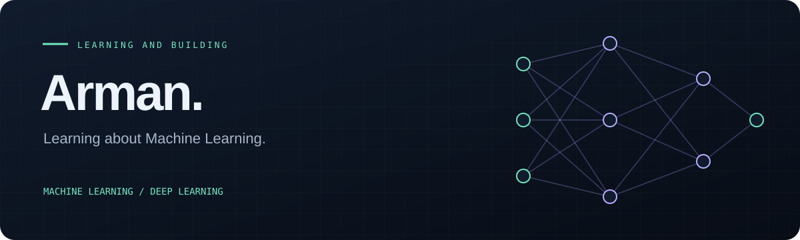

  

  <strong>Machine Learning · Deep Learning · API Development</strong>

  

## About me

Hi, I'm **Arman Uddin**. I'm interested in **Machine Learning and Deep Learning**, particularly how models learn from data and solve practical problems. I'm currently learning **FastAPI** and exploring how to build APIs for useful applications.

My public projects include work with **JavaScript and HTML**. I enjoy exploring other areas of technology and developing my skills through hands-on projects.

## Current focus

| Area | Focus |
| :--- | :--- |
| **Interests** | Machine Learning and Deep Learning |
| **Currently learning** | FastAPI and API development |
| **Project experience** | JavaScript and HTML |
| **Exploring** | Other sectors of technology |

  
  
  

## Selected projects

| Project | Technology |
| :--- | :--- |
| [**Midas ↗**](https://github.com/Arman-zz/Midas) | JavaScript |
| [**repo_demo ↗**](https://github.com/Arman-zz/repo_demo) | HTML |

[Browse all repositories →](https://github.com/Arman-zz?tab=repositories)

## GitHub activity

  
  

---

  <a href="https://github.com/Arman-zz">Find me on GitHub</a> 
  Curiosity. Practice. Progress.

